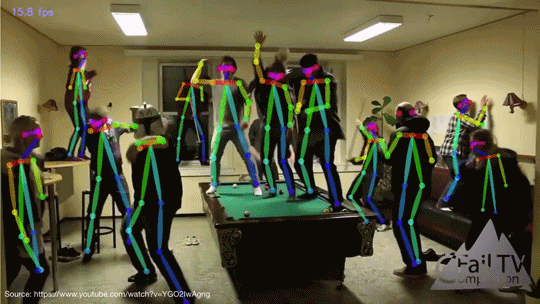

# ML5 Workshop

Code that combines a smoke particle system in [P5.js](https://p5js.org/) with a Openpose implementation using [ML5.js](https://ml5js.org/). The openpose example comes straight from the ML5 examples and the [smoke particle system](https://p5js.org/examples/simulate-smokeparticles.html) was written by Dan Shiffman (I think).

## Keypoint IDs

| Id | Part |
| -- | -- |
| 0 | nose |
| 1 | leftEye |
| 2 | rightEye |
| 3 | leftEar |
| 4 | rightEar |
| 5 | leftShoulder |
| 6 | rightShoulder |
| 7 | leftElbow |
| 8 | rightElbow |
| 9 | leftWrist |
| 10 | rightWrist |
| 11 | leftHip |
| 12 | rightHip |
| 13 | leftKnee |
| 14 | rightKnee |
| 15 | leftAnkle |
| 16 | rightAnkle |
